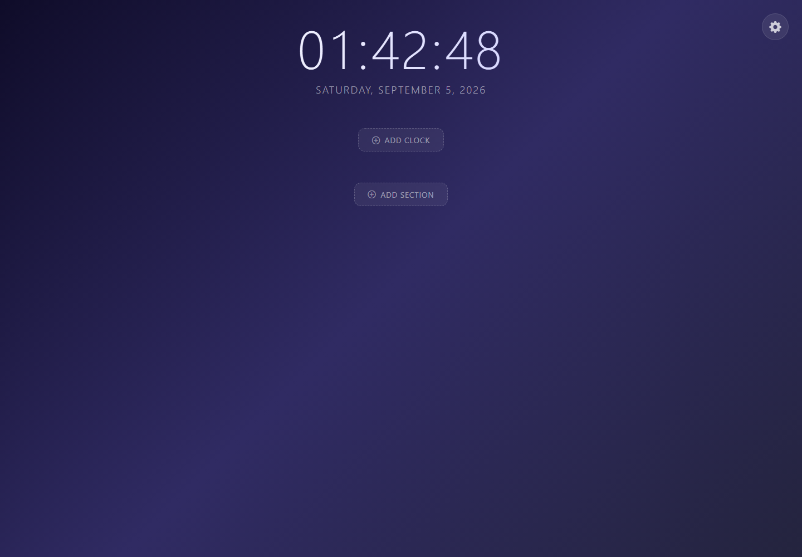

# New Tab Widgets

A privacy-first Chrome new-tab dashboard for clocks, grouped shortcuts and portable workspace settings. It is deliberately dependency-light, requests only local storage, and ships every runtime asset inside the extension.



## Why this project

New Tab Widgets turns an otherwise empty browser surface into a useful start page without an account, tracking script or hosted backend. It demonstrates browser-extension architecture, local-first state, CSP-safe packaging and a responsive interactive UI.

## Features

- Primary local clock with 12/24-hour, seconds and date preferences
- Named regional clocks across 40+ IANA time zones
- Homarr-style shortcut sections with nested links and inline editing
- Built-in and user-supplied shortcut icons
- JSON configuration backup and restore
- Responsive glass UI with local Bootstrap and Bootstrap Icons assets
- Zero analytics and zero remote runtime requests

## Install from source

1. Download or clone this repository.
2. Open `chrome://extensions` in Chrome or a Chromium browser.
3. Enable **Developer mode**.
4. Select **Load unpacked** and choose this repository folder.
5. Open a new tab.

## Use

- Select **Add clock** to track another time zone.
- Select **Add section** to create a shortcut group, then add apps or nested links.
- Open **Settings** to change clock formatting, export a backup, import one, or reset the dashboard.
- Hover a clock, section or shortcut to expose its edit and remove actions.

## Privacy and permissions

The only requested permission is `storage`, used to keep configuration in the browser profile. There are no content scripts, host permissions, analytics or remote code. See [PRIVACY.md](PRIVACY.md).

## Verify a release

Node.js 20 or newer is sufficient; there are no package dependencies.

```bash
npm test
npm run check:js
```

The automated check validates Manifest V3, the minimal permission set, all packaged assets, local-only HTML references and JavaScript syntax. GitHub Actions runs both checks on every push and pull request.

## Project structure

```text
manifest.json          Manifest V3 definition and minimal permission
newtab.html            Accessible dashboard and modal structure
newtab.js              State, clocks, sections, shortcuts, import/export
styles.css             Responsive glass interface
lib/                   Locally bundled Bootstrap runtime assets
icons/                 Extension icons
scripts/               Dependency-free release verification
```

## Release history

See [CHANGELOG.md](CHANGELOG.md). The current release is `1.1.0`.

## License

MIT
